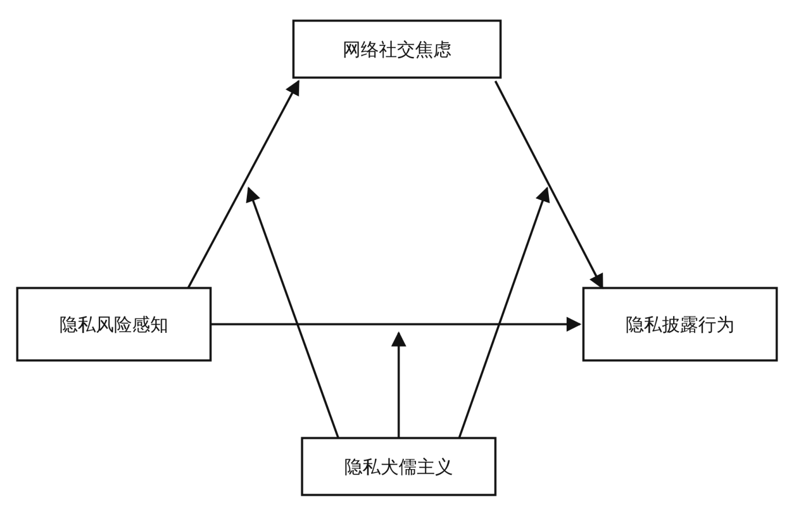
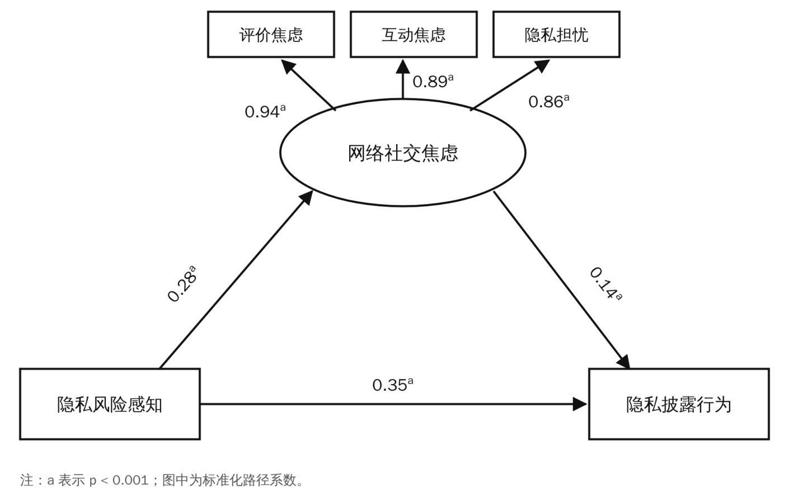
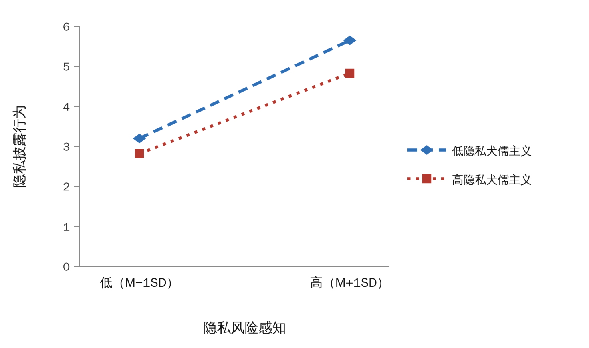
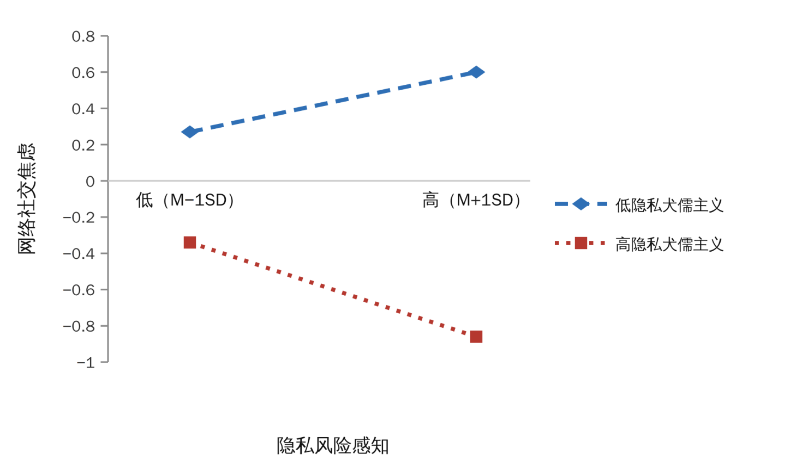

# 大学生隐私风险感知与隐私披露行为：网络社交焦虑的中介作用与隐私犬儒主义的调节作用

> **原文**：Huang S, Yuan L, Yang Y, Li J, Chen Y, Liu Y, Zhang S and Liu P (2026). Privacy risk perception and privacy disclosure behavior among college students: the mediating role of online social anxiety and the moderating role of privacy cynicism. *Frontiers in Psychology* 17:1891374. doi: 10.3389/fpsyg.2026.1891374
>
> **作者单位**：黄舒燕¹²、袁立庄³、杨雨轩¹²、李静⁴、陈奕坛³、刘颖杰¹²、张树豪⁵\*、刘鹏⁵\*
> ¹华北理工大学心理与精神卫生学院，唐山；²华北理工大学河北省心理与脑科学重点实验室，唐山；³河北师范大学心理学系，石家庄；⁴河北医科大学第一医院，石家庄；⁵华北理工大学生命科学学院，唐山
> \*通讯作者：张树豪（psyzhang7@163.com）、刘鹏（liupeng101a@ncst.edu.cn）
>
> **投稿** 2026-05-26｜**修回** 2026-07-18｜**录用** 2026-07-20｜**发表** 2026-08-06
>
> **关于插图**：文中四张图为依据原文图片重绘的中文版，图形结构、数据点与统计标注均与原图一致，仅将图内英文标签译为中文。原始英文图见 PDF 原文。
>
> **版权与许可**：© 2026 作者。本文为依据 Creative Commons 署名许可（CC BY）发布的开放获取论文，在署名原作者与版权人、并按学术惯例引用原始出处的前提下，允许在其他场合使用、分发或复制。本中文译本据此许可翻译，仅供阅读参考；如有歧义以英文原文为准。

---

## 摘要

**背景**：社交媒体是大学生日常交流的重要平台，但网络诈骗事件频发已引起广泛关注。有意思的是，许多用户即使有很高的风险感知，也并未因此停止披露个人信息。为进一步探讨当下社交网络中大学生的"隐私悖论"，本研究考察了大学生隐私风险感知与隐私披露行为之间的关系，以及网络社交焦虑和隐私犬儒主义在其中的作用机制。

**方法**：采用感知隐私风险量表、隐私披露行为量表、社交媒体用户社交焦虑量表和隐私犬儒主义量表，对 1,276 名大学生进行问卷调查。

**结果**：隐私风险感知与大学生隐私披露行为呈显著正相关；网络社交焦虑在隐私风险感知与隐私披露行为之间起部分中介作用；隐私犬儒主义显著调节隐私风险感知对网络社交焦虑及对隐私披露行为的影响。

**结论**：研究结果揭示了大学生隐私决策中情绪与认知态度的交互作用，为网络安全教育提供了新的视角。

**关键词**：大学生；网络社交焦虑；隐私犬儒主义；隐私披露行为；隐私风险感知

---

## 引言

当前，电信网络诈骗事件频发。在中国，大学生已成为易受此类诈骗侵害的高风险群体（Tan 等，2025）。相关报告显示，2000 年后出生的学生占受骗者的 18.2%，且该群体的增幅最大（Sun 等，2024）。研究表明，大学生个人信息泄露是此类诈骗的主要成因之一（Shen，2017）。作为社交网络的"原住民"，大学生常因使用不当和自我保护意识不足而遭遇个人隐私泄露（Zhang & Li，2019）。

**隐私披露行为**指个体有意向外部环境或他人透露自身私密或敏感信息的行为（Kolotylo-Kulkarni 等，2021）。多项研究指出，遭遇电信网络诈骗会给大学生带来一系列负面影响，如经济负担、消极情绪体验、自毁倾向，甚至角色反转走向犯罪（Sun & Zhao，2024；Li，2007）。因此，探究社交网络中隐私披露行为的影响因素与机制，对预防大学生成为电信网络诈骗受害者、保护其财产与身心健康具有重要现实意义。

### 隐私风险感知与隐私披露行为

**隐私风险感知**指个体对披露信息可能带来的负面后果（信息被滥用、身份被盗用、社会声誉受损等）的主观评估（Li Y. Y. 等，2023）。根据**保护动机理论（PMT）**，风险感知作为个体对威胁的认知评估，是驱动隐私保护行为的核心前因变量，也是预测隐私披露行为的关键认知因素（Rogers，1975）。实证研究显示，隐私风险感知负向预测隐私披露行为（Zhou & Liu，2023）：当个体越是感到个人信息可能被泄露或滥用，就越倾向于减少个人信息的披露。

然而在社交媒体情境下，研究者得到了不同的观察结果：尽管用户已意识到社交网络中隐私泄露的现实与风险，但这并未显著改变他们在个人资料中披露的信息量（Pu & Fei，2023）。这种隐私关注与隐私披露行为之间的矛盾被称为**隐私悖论**（Dienlin 等，2023）。**隐私计算理论（PCT）**为理解该悖论提供了有用的解释框架：个体的隐私决策并非仅取决于其感知到的风险水平，而是在预期收益与潜在风险之间进行的情境性权衡（Culnan & Armstrong，1999）。Taddicken（2014）对德国网民的研究系统考察了信息披露的程度与渠道，发现隐私关注与实际披露行为之间并无显著直接关联。中国学者也观察到，微信使用情境下的风险感知虽然会提高个体对隐私问题的关注度，但这种意识并未直接转化为披露意愿或行为的减少（Li J. H. 等，2023）。这可能是因为大学生正处于建立自我同一性、拓展社交网络的关键阶段——即便他们对个人信息安全的潜在风险表示担忧，也不会为此改变自我披露的习惯与行为，因为他们需要借此获得社会接纳、维系社会联结或获取服务（Pu & Fei，2023）。

上述不一致的发现表明，隐私风险感知与披露行为之间关系的方向并非固定，而可能同时受到个体情感体验与认知态度的调节。已有证据表明，社交媒体上的负面经历（如数据被窃、人际冲突、网络欺凌）不仅会直接促使用户采取身份遮蔽、规范使用等隐私保护行为，也会通过激活隐私关注和信息披露意识而间接影响这些行为（Niu 等，2024；Niu 等，2025）。此外，Mazhar 等（2025）从隐私悖论视角发现：网络身份披露意识虽能促进社交媒体用户的隐私保护行为，但这一正向效应会被网络隐私关注负向调节——即关注水平越高，意识转化为行动的效率反而显著下降。这些发现共同表明，风险感知与披露行为之间的关系并非简单的线性关系。

综上，尽管以往研究已揭示隐私风险感知与隐私披露行为之间存在关联，但结论并不一致，二者关系的强度与方向可能受到其他心理因素或个体特征的调节。因此，本研究聚焦大学生群体，在控制性别、年级、独生子女等人口学变量的基础上，进一步检验隐私风险感知与隐私披露行为的关系，并探讨潜在的中介机制与调节变量，以厘清这一关系的作用路径与边界条件。

### 网络社交焦虑的中介作用

**网络社交焦虑**指个体在社交媒体平台上进行社交互动时体验到的紧张、担忧等消极情绪（Chen 等，2023），通常表现为分享内容后过度在意他人评价、对社交媒体上个人隐私保护的持续不安，以及害怕在互动中得不到积极回应或遭到社交拒绝（Hong 等，2015）。**传播隐私管理理论（CPM）**强调，个体通过建立隐私边界来控制个人信息的流动（Petronio，2002）。当用户感到对这些边界的控制能力被削弱、或边界被侵犯的风险上升时，就会体验到强烈的心理不适。在社交媒体环境中，这种不适常表现为网络社交焦虑——一种因害怕失去对隐私边界的控制而产生的紧张状态（Jiang 等，2008）。

以往研究记录了较高的隐私风险感知会带来更高水平的网络社交焦虑。社交媒体的持续可见性意味着用户在开展网络活动时，其个人资料可能在未经授权的情况下被他人访问，个人信息可能在用户不知情的情况下被获取（Davidson & Farquhar，2014）。在这种环境中，用户往往与众多线上联系人之间缺乏共同认可的隐私规则，这种边界模糊可能导致信息被不当传播，进而对现实人际关系产生负面影响（Niu & Meng，2019）。这种心理负担可能直接引发并加剧线上互动中的紧张、担忧与自我审查，从而导致更高水平的社交焦虑。

此外，一些研究揭示社交焦虑会显著抑制隐私披露行为。高社交焦虑个体因过度担忧负面评价与隐私泄露，往往减少自我披露及其他社交活动，这妨碍了良好人际关系的建立，导致社交需求得不到满足，形成恶性循环（Liu 等，2018）。研究证实，这类个体在人际互动中往往更为拘谨和退缩：尽管渴望给他人留下好印象，却缺乏自我披露的信心和必要的社交技能，因而其披露行为（包括私密信息的披露）更为受限（Brand 等，2016）。

综上，我们假设隐私风险感知可能通过网络社交焦虑影响大学生的自我披露行为，即网络社交焦虑可能在隐私风险感知与隐私披露行为之间起中介作用。

### 隐私犬儒主义的调节作用

**隐私犬儒主义**指个体对互联网平台隐私保护所持的消极与不信任态度（Hoffmann 等，2024），其结果是主观上认为隐私保护徒劳无益。研究表明，犬儒主义这一认知倾向深刻塑造着个体的决策过程（Brockway 等，2002）。在数据监控情境下，高隐私犬儒主义的用户认为隐私泄露不可避免、隐私保护毫无意义，这可能导致他们放弃对个人信息的保护，在网上披露更多数据（Li J. H. 等，2023）。Van Ooijen 等（2024）发现，对于隐私犬儒主义水平高的个体，感知收益与隐私保护行为之间的负向关系会转变为正向关系：当个体对隐私保护高度怀疑时，他们可能基于**成本最小化逻辑**，在感知到明确收益时才采取保护措施——这提示了一种与传统理性决策模型存在质的差异的行为模式。

基于相关研究，隐私犬儒主义可能在隐私风险感知与隐私披露行为之间发挥重要的调节作用。已有研究提供了提示性证据：用户的社交媒体倦怠水平与其个人信息披露行为显著正相关。由于犬儒主义是倦怠的核心表现之一，高隐私犬儒主义用户所持的消极态度可能成为其在网络上披露更多个人信息的潜在驱动因素（Anderson & Agarwal，2010；Cramer 等，2016）。

隐私犬儒主义也可能在隐私风险感知影响网络社交焦虑的过程中发挥重要作用。高犬儒主义个体对潜在隐私风险的心理预期本就很高，即使感知到显著的隐私风险，这种感知也不太容易转化为强烈的焦虑（Ye，2025）。这种"预期已然实现"的认知风格有助于他们在面对潜在隐私威胁时保持相对平静，避免陷入过度焦虑。

隐私犬儒主义还可能调节网络社交焦虑对隐私披露行为影响的强度与方向。对于高隐私犬儒主义个体，网络社交焦虑对信息披露的抑制作用会显著减弱（Xie 等，2018）。尽管这些用户体验到社交焦虑，但他们坚信隐私无法得到保护、任何隐私保护措施都是徒劳，因此可能采取更宽松的信息披露策略。这种认知风格削弱了风险感知与行为抑制之间的传统关联，使得焦虑不再必然导致披露行为的减少。

### 研究假设

基于以上分析，本研究考察大学生隐私披露行为的影响因素与内在机制，检验隐私风险感知的直接效应、网络社交焦虑的中介作用以及隐私犬儒主义的调节作用。就隐私风险感知与隐私披露行为的关系而言，已有结论仍存争议：部分研究支持负向预测，另一些则报告无显著关联。这种分歧可能源于对情绪与认知调节因素的忽略。不过，根据 PMT，风险感知作为威胁评估的核心认知变量，应当促进保护性行为，即抑制隐私披露行为。因此提出以下假设：

- **H1**：隐私风险感知负向预测大学生的隐私披露行为；
- **H2**：网络社交焦虑在隐私风险感知与隐私披露行为之间起中介作用；
- **H3**：隐私风险感知对隐私披露行为的影响，以及网络社交焦虑在其中的中介作用，均受隐私犬儒主义的调节。

假设模型见图 1。

**图 1　研究模型。** 隐私风险感知既直接指向隐私披露行为，也经由网络社交焦虑间接起作用；隐私犬儒主义分别调节这三条路径。

---

## 方法

### 被试

以大学生为研究对象，采用方便抽样法，在京津冀地区六所高校招募被试。被试自愿完成问卷并签署知情同意书。纳入标准：（1）被试知情同意；（2）认知能力正常、意识清晰。排除标准：（1）非自愿参与；（2）作答不完整、规律性作答，或作答时间过长/过短。

共回收匿名问卷 1,293 份，其中有效问卷 1,276 份，有效回收率 98.7%。有效样本中，男生 488 人（38.2%），女生 788 人（61.8%）；大一 464 人（36.4%），大二 314 人（24.6%），大三 394 人（30.9%），大四 104 人（8.1%）；理工科 541 人（42.4%），社会科学 342 人（26.8%），医学 393 人（30.8%）；独生子女 280 人（21.9%），非独生子女 996 人（78.1%）；城镇生源 370 人（29.0%），农村生源 906 人（71.0%）。

本研究经华北理工大学伦理委员会批准（批准号 2025160）。

### 研究工具

**感知隐私风险量表**：由 Dinev 和 Hart（2006）编制，用于测量个体对个人信息泄露的不可预测性及其后果的感知水平。单维度自评量表，共 4 个条目，采用 5 点李克特计分（1＝非常不同意，5＝非常同意），得分越高表示感知到的隐私风险越强。本样本中 Cronbach's α = 0.94。

**隐私披露行为量表**：由 Dienlin 和 Trepte（2015）编制，用于评估个体向社交媒体提供个人信息的实际程度。单维度自评量表，共 5 个条目，5 点李克特计分（1＝非常不同意，5＝非常同意），得分越高表示隐私披露行为水平越高。本样本中 Cronbach's α = 0.76。

**社交媒体用户社交焦虑量表**：由 Chen 等（2020）修订，用于评估个体的网络社交焦虑水平。包含评价焦虑、互动焦虑、隐私担忧三个维度，共 20 个条目，5 点李克特计分（1＝完全不同意，5＝完全同意），得分越高表示网络社交焦虑水平越高。本样本中总量表 Cronbach's α = 0.96，三个分量表分别为 0.93、0.91、0.81。

**隐私犬儒主义量表**：由 Li J. H. 等（2023）修订，用于测量用户在对社交媒体的不信任、对个人信息使用的不确定、隐私保护中的无力感、隐私披露中的顺从这四个方面的水平。包含不信任、不确定、无力感、顺从四个维度，共 8 个条目，5 点李克特计分（1＝非常不同意，5＝非常同意），得分越高表示隐私犬儒主义水平越高。本样本中总量表 Cronbach's α = 0.86，四个分量表分别为 0.86、0.81、0.79、0.69。

### 核心构念的心理层次界定

为确保后续统计检验与效应解释的概念清晰性，本研究首先界定四个核心构念所处的心理层次：**隐私风险感知**属于**认知评估层面**，反映个体对信息泄露可能性与严重性的主观判断；**网络社交焦虑**属于**情绪体验层面**，反映个体在社交媒体互动中的紧张与不安，其"隐私担忧"维度反映的是情绪性忧虑而非认知性风险评估；**隐私犬儒主义**属于**态度信念层面**，反映个体对隐私保护有效性的整体消极信念；**隐私披露行为**属于**行为反应层面**，反映实际的自我披露行动。

### 数据分析

使用 SPSS 24.0 进行描述性统计、信度分析和 Pearson 相关分析。采用 Harman 单因子检验共同方法偏差：对所有条目进行主成分因素分析，共提取出 5 个特征根大于 1 的因子，第一个因子解释的变异量为 36.69%，低于 40% 的临界值，表明本数据中共同方法偏差不严重。

已有研究表明：性别与隐私关注显著相关，女性的隐私意识通常高于男性（Baruh 等，2017），这可能源于性别社会化对威胁评估过程的影响；年级与大学生在社交网站上的自我披露有关，低年级学生通常表现出更多披露行为（Lin 等，2023），这可能是因为低年级学生面对新的社交环境，亟需通过自我披露建立人际关系、寻求社会认可；专业影响个体对信息分享的态度与习惯，不同专业学生的自我披露程度存在差异（Lin 等，2023），学科训练可能培养出不同的分析思维方式与数字素养，进而影响个体对隐私威胁与披露收益的评估；生源地在一定程度上反映大学生数字接触水平的差异（Zeng，2011），早期数字接触可能影响个体的隐私意识及其对隐私问题的判断与处理；是否独生子女与家庭资源和社会支持网络有关，会间接影响个体的社交焦虑与披露行为（Liao & Shi，2016），家庭结构差异可能塑造不同的人际依赖模式与情绪调节策略，进而与网络社交焦虑及自我披露倾向相关联。

若不加以控制，这些变量可能混淆对风险感知、焦虑与行为之间关系的准确估计。因此，本研究将性别、年级、专业、生源地和独生子女状况纳入控制变量。

使用 AMOS 24.0 进行验证性因素分析和中介效应的路径分析；使用 PROCESS Macro v3.3 检验有调节的中介效应，采用偏差校正 Bootstrap 法，重复抽样 5,000 次，置信水平 95%。p < 0.05 视为具有统计学意义。

---

## 结果

### 描述性统计与相关分析

各核心变量的描述统计为：隐私风险感知（15.30 ± 4.19）、隐私披露行为（12.50 ± 3.33）、网络社交焦虑（58.52 ± 14.13）、隐私犬儒主义（24.77 ± 5.33）。Pearson 相关分析显示，隐私风险感知、隐私披露行为、网络社交焦虑及其各维度、隐私犬儒主义两两之间均呈显著正相关（p < 0.01）。

**表 1　描述统计与相关分析结果（n = 1,276）**

| 变量 | M | SD | 1 | 2 | 3 | 4 | 5 | 6 |
|---|---|---|---|---|---|---|---|---|
| 1. 隐私风险感知 | 15.30 | 4.19 | | | | | | |
| 2. 隐私披露行为 | 12.50 | 3.33 | 0.39\*\* | | | | | |
| 3. 网络社交焦虑 | 58.52 | 14.13 | 0.28\*\* | 0.24\*\* | | | | |
| 4. 评价焦虑 | 29.42 | 7.36 | 0.27\*\* | 0.26\*\* | 0.97\*\* | | | |
| 5. 互动焦虑 | 16.86 | 4.60 | 0.17\*\* | 0.19\*\* | 0.93\*\* | 0.84\*\* | | |
| 6. 隐私担忧 | 12.24 | 3.06 | 0.37\*\* | 0.21\*\* | 0.89\*\* | 0.80\*\* | 0.77\*\* | |
| 7. 隐私犬儒主义 | 24.77 | 5.33 | 0.38\*\* | 0.31\*\* | 0.55\*\* | 0.55\*\* | 0.45\*\* | 0.53\*\* |

注：\*p < 0.05，\*\*p < 0.01。

### 测量模型评估

在检验研究假设前，使用 AMOS 24.0 对四个核心构念进行验证性因素分析（CFA），以评估测量模型的拟合度。结果为：χ²/df = 6.20，CFI = 0.90，TLI = 0.89，RMSEA = 0.06，SRMR = 0.07。χ²/df 略高于推荐的临界值 5，这可能归因于本数据样本量较大且测量条目较多（χ² 统计量对样本量和指标数量均较敏感）。鉴于 CFI 达到 0.90 的可接受标准，且 RMSEA 与 SRMR 均低于 0.08 的推荐标准，测量模型被判定为具有可接受的拟合水平，可进行后续分析。

同时，所有测量条目的标准化因子载荷在 0.40～0.95 之间，且均具有统计学意义（p < 0.001），未因载荷过低而删除条目。所有潜变量的组合信度（CR）均超过 0.70 的可接受标准，平均方差抽取量（AVE）在 0.39～0.81 之间，表明聚合效度基本可接受。

值得注意的是，隐私犬儒主义"顺从"子维度的 Cronbach's α 为 0.69，略低于 0.70 的常规标准。这可能是因为该子维度仅由 3 个条目构成，较短的量表往往产生较低的 α 值。不过，鉴于该变量的 CR 值仍超过 0.70，其内部一致性在实际研究中仍属可接受范围。

总体而言，测量模型表现出可接受的心理测量学特性，数据适合进行后续的实质性分析与假设检验。

**表 2　验证性因素分析拟合指标**

| 潜变量 | CR | AVE | 标准化因子载荷范围 |
|---|---|---|---|
| 隐私风险感知 | 0.95 | 0.81 | 0.83–0.95 |
| 隐私披露行为 | 0.75 | 0.39 | 0.40–0.75 |
| 网络社交焦虑 | 0.96 | 0.54 | 0.59–0.82 |
| 隐私犬儒主义 | 0.86 | 0.44 | 0.44–0.85 |

### 网络社交焦虑的中介效应

数据标准化后，在 AMOS 24.0 中建立模型检验中介效应。路径分析显示：隐私风险感知与隐私披露行为显著正相关（β = 0.35，p < 0.001）；隐私风险感知与网络社交焦虑显著正相关（β = 0.28，p < 0.001）；网络社交焦虑与隐私披露行为显著正相关（β = 0.14，p < 0.001）。偏差校正百分位 Bootstrap 法表明，网络社交焦虑在隐私风险感知与隐私披露行为之间的中介效应显著，效应值为 0.04（95%CI = [0.02, 0.07]），中介效应占总效应的 10.26%。

**表 3　总效应、直接效应与中介效应分解**

| 项目 | 效应值 | 标准误 | 95%CI | 效应占比(%) |
|---|---|---|---|---|
| 总效应 | 0.39 | 0.03 | 0.33 ~ 0.45 | |
| 直接效应 | 0.35 | 0.03 | 0.28 ~ 0.40 | 89.74 |
| 间接效应 | 0.04 | 0.01 | 0.02 ~ 0.07 | 10.26 |

**图 2　网络社交焦虑在隐私风险感知与隐私披露行为之间的中介模型。** 椭圆为潜变量，方框为观测变量／维度；数值为标准化路径系数，上标 a 表示 p < 0.001。

上述中介分析结果表明，隐私风险感知与隐私披露行为之间存在显著正相关。这一结果**与假设 H1 不一致，H1 未获支持**。这种正向关联似乎印证了隐私悖论现象：在大学生群体中，高水平的风险感知并未如传统威胁评估理论所预测的那样抑制行为。这初步提示，他们的决策过程可能更符合隐私计算理论中"收益—风险权衡"的逻辑。此外，网络社交焦虑在两变量之间的间接效应显著，表明情绪体验可能是连接认知评估与行为反应的重要桥梁，**假设 H2 获得支持**。

### 隐私犬儒主义的调节效应

采用 PROCESS 宏的 Model 59，在控制性别、年级、专业、生源地和独生子女状况的条件下检验隐私犬儒主义的调节作用。该模型同时纳入隐私犬儒主义的主效应以及两个乘积交互项（隐私犬儒主义分别与隐私风险感知、与网络社交焦虑的交互）。由于该模型设定与表 2 的简单中介模型不同，隐私风险感知对隐私披露行为的直接效应系数在数值上有所差异，但两组结果并不冲突。

回归结果显示：纳入隐私犬儒主义后，隐私犬儒主义与隐私披露行为显著正相关（β = 0.14，SE = 0.03，p < 0.001）；隐私风险感知 × 隐私犬儒主义的交互项与隐私披露行为显著相关（β = −0.05，SE = 0.02，p < 0.05）；隐私犬儒主义与网络社交焦虑显著正相关（β = 0.50，SE = 0.03，p < 0.001）；隐私风险感知 × 隐私犬儒主义的交互项与网络社交焦虑显著相关（β = −0.10，SE = 0.02，p < 0.001）；而网络社交焦虑 × 隐私犬儒主义的交互项与隐私披露行为的关联不显著（β = −0.03，SE = 0.02，p > 0.05）。这些结果共同表明，隐私犬儒主义调节了隐私风险感知与隐私披露行为之间、以及隐私风险感知与网络社交焦虑之间的关系。

**表 4　有调节的中介检验**

| 预测变量 | 网络社交焦虑 β | SE | t | 隐私披露行为 β | SE | t |
|---|---|---|---|---|---|---|
| 性别 | 0.05 | 0.05 | 0.99 | 0.01 | 0.05 | 0.01 |
| 年级 | 0.01 | 0.02 | 0.49 | 0.04 | 0.03 | 1.67 |
| 专业 | 0.02 | 0.02 | 0.67 | −0.02 | 0.03 | −0.90 |
| 生源地 | 0.03 | 0.05 | 0.58 | 0.03 | 0.06 | 0.42 |
| 独生子女 | 0.02 | 0.06 | 0.31 | −0.03 | 0.06 | −0.42 |
| 隐私风险感知 | 0.04 | 0.03 | 1.46 | 0.29 | 0.03 | 10.14\*\*\* |
| 网络社交焦虑 | — | — | — | 0.07 | 0.03 | 2.06\* |
| 隐私犬儒主义 | 0.50 | 0.03 | 19.70\*\*\* | 0.14 | 0.03 | 3.92\*\*\* |
| 隐私风险感知 × 隐私犬儒主义 | −0.10 | 0.02 | −5.37\*\*\* | −0.05 | 0.02 | −2.21\* |
| 网络社交焦虑 × 隐私犬儒主义 | — | — | — | −0.03 | 0.02 | −1.44 |
| R² | 0.33 | | | 0.20 | | |
| F | 76.31\*\*\* | | | 30.71\*\*\* | | |

注：\*p < 0.05，\*\*p < 0.01，\*\*\*p < 0.001。

最后，以均值加减一个标准差将隐私犬儒主义分为高、低两组，绘制简单斜率图进一步分析其调节效应。

分析显示（图 3）：对于低隐私犬儒主义的大学生，隐私风险感知与隐私披露行为显著正相关（B_simple = 0.34，t = 10.72，p < 0.001）；对于高隐私犬儒主义的大学生，二者的关联较弱（B_simple = 0.24，t = 6.26，p < 0.001）。

**图 3　隐私犬儒主义对"隐私风险感知—隐私披露行为"关系的调节作用。** 两组斜率均显著为正，但高隐私犬儒主义组的斜率更平缓（0.24 对 0.34）。

进一步分析隐私犬儒主义对"隐私风险感知—网络社交焦虑"关系的调节作用，结果显示（图 4）：在低隐私犬儒主义组，隐私风险感知与网络社交焦虑显著正相关（B_simple = 0.12，t = 4.68，p < 0.001）；在高隐私犬儒主义组，二者的关联不显著（B_simple = −0.05，t = −1.44，p > 0.05）。

**图 4　隐私犬儒主义对"隐私风险感知—网络社交焦虑"关系的调节作用。** 低隐私犬儒主义组斜率显著为正（0.12），高隐私犬儒主义组斜率不显著（−0.05）。

> **译者注（图 3、图 4 的读法）**：两图的横轴均为隐私风险感知的低（M−1SD）／高（M+1SD）水平，图例的"低／高"指的是**调节变量隐私犬儒主义**的水平。需要注意的是，两图中"高隐私犬儒主义"的线整体都位于"低隐私犬儒主义"线的下方，这与表 4 中隐私犬儒主义对隐私披露行为（β = 0.14）和对网络社交焦虑（β = 0.50）均为**显著正向**主效应的结果在方向上不一致。原文对此未作说明。简单斜率图的解释重点在于两条线的**斜率差异**（即调节效应本身），这一部分与正文和表 5 完全吻合；至于两条线的相对**高度**，建议以表 4 的回归系数为准。

这些结果表明隐私犬儒主义具有显著的调节作用：在隐私风险感知与隐私披露行为的关系中，隐私犬儒主义显著削弱了二者关联的强度；在隐私风险感知与网络社交焦虑的关系中，低隐私犬儒主义组存在显著正相关，而高隐私犬儒主义组则不显著。隐私风险感知对隐私披露行为的直接效应，以及网络社交焦虑的中介效应，均呈现递减趋势。

**表 5　隐私犬儒主义调节作用分析**

| 路径 | 隐私犬儒主义 | 效应值 | Boot SE | Boot LLCI | Boot ULCI |
|---|---|---|---|---|---|
| 直接效应 | M−SD | 0.34 | 0.03 | 0.28 | 0.40 |
| | M | 0.29 | 0.03 | 0.24 | 0.35 |
| | M+SD | 0.24 | 0.04 | 0.17 | 0.32 |
| 网络社交焦虑的中介效应 | M−SD | 0.12 | 0.03 | 0.07 | 0.17 |
| | M | 0.04 | 0.03 | −0.01 | 0.09 |
| | M+SD | −0.05 | 0.03 | −0.11 | 0.02 |

基于以上结果，**假设 H3 获得部分支持**。具体而言，隐私犬儒主义对直接路径和中介路径的**前半段**具有显著调节作用，但对中介路径**后半段**的调节作用不显著。这表明隐私犬儒主义的调节功能可能具有**路径特异性**：它主要作用于"风险感知→情绪反应"的认知转化阶段，以及认知直接影响行为决策的阶段；却并不显著调节焦虑情绪转化为实际行为的强度。

---

## 讨论

本研究将一种情绪反应（网络社交焦虑）与一种认知态度（隐私犬儒主义）结合起来，进一步厘清隐私风险感知与隐私披露行为之间的复杂关系。基于保护动机理论、传播隐私管理理论和隐私计算理论，构建并检验了一个有调节的中介模型，有助于深化对隐私风险感知影响披露行为之内在机制的理解。

### 隐私风险感知对大学生隐私披露行为的影响

实证结果表明，大学生的隐私风险感知与其隐私披露行为显著正相关：当大学生在社交媒体使用中感知到更高的隐私风险时，他们仍倾向于披露更多个人信息。这一观察表明，PMT 所假定的"风险感知→保护行为"的线性逻辑，在大学生的社交媒体情境中并未得到支持。

这一发现与以往研究（Peng 等，2022；Niu & Meng，2019）不同，但与 PCT 大体一致：当感知到的情境收益足够突出时，个体即便意识到潜在隐私风险，也可能为短期获益而自愿披露信息（Culnan & Armstrong，1999；Hallam & Zanella，2017）。Hashmat 和 Azeema（2025）报告了年龄与自我披露之间的显著负相关——18 至 25 岁的年轻用户在披露个人信息时，隐私关注度低于年长用户。当代大学生沉浸在互联网带来的即时满足中，倾向于将隐私披露与多重收益联系起来（Lan，2017）。

从**社会收益**角度看，自我披露有助于建立和维系人际关系，也有助于获得同伴关注与社会认可。对于正处于自我同一性建立与社会资本积累关键期的大学生而言，网络平台提供的归属感可能是促使其披露个人信息的关键因素。从**功利收益**角度看，社交媒体平台通过物质激励和个性化推荐鼓励用户披露数据，用户往往将信息披露视为获取免费资源和便捷服务的必要条件（Li，2023）。因此，尽管大学生看似认识到隐私风险，但在社会认可、实用价值和自我呈现等多重收益的影响下，仍可能选择披露信息，表现出**收益优先**的决策倾向。

与此同时，在当前网络环境下，社交媒体应用获取用户私人信息已成常态（Wu & Yao，2022）。社交媒体的"重度用户"在频繁互动中往往风险感知有所提升，但这种提升的意识似乎与其继续享受社交网络的行为**并存**而非对其构成约束，其隐私披露行为看起来仍在持续增加（Kwon & Johnson，2015）。这一模式共同表明，在当下的社交媒体生态中，风险感知与披露行为可能是共存关系，而非对立关系。

### 网络社交焦虑的中介效应

在确立直接关联后，本研究进一步考察其内在机制。中介分析发现，网络社交焦虑可能在大学生隐私风险感知与隐私披露行为之间起部分中介作用。

具体而言，隐私风险感知较高的大学生也体验到更高的网络社交焦虑，这与以往研究一致（Davidson & Farquhar，2014）。对隐私和他人评价的担忧是用户焦虑的重要来源。大学生将社交媒体环境中信息被收集和数据被滥用的可能性视为对其个人形象、社会关系和隐私空间的潜在威胁，同时又感到无法完全控制或规避这些风险。这种认知评估模式往往伴随焦虑、担忧等负面情绪（Cong 等，2025；Josol & Albon，2025）。

研究结果还表明，网络社交焦虑较高的大学生倾向于披露更多个人信息。以往研究已将消极情绪状态与特定的社交媒体行为联系起来（Lee，2014）。当个体将隐私风险评估为一种社会威胁时会体验到焦虑；为缓解这种不适，他们可能习惯性地转向网络平台进行情绪调节，而披露个人信息便成为缓解负面情绪的一种方式。此外，在其主观权衡中，降低焦虑的即时收益可能超过隐私成本。这一模式或可解释为何在引发焦虑的情境中隐私披露反而增加（Zhu 等，2025；Wang 等，2024）。

### 隐私犬儒主义的调节效应

在确认中介机制后，本研究进一步探究该过程的边界条件。有调节的中介分析表明，隐私犬儒主义的调节作用仅限于直接路径和中介路径的前半段，且有调节的中介效应仅在**低**隐私犬儒主义条件下显著。这说明隐私犬儒主义对中介过程的调节作用相对有限且有条件。

就**直接路径**而言，随着隐私犬儒主义水平的提高，隐私风险感知与隐私披露行为之间关联的强度显著下降，表明犬儒态度可能削弱认知与行为之间的联系。对于高隐私犬儒主义的用户，尽管他们意识到社交媒体环境中个人信息可能被滥用的潜在风险，但其决策过程往往伴随强烈的无力感与不信任（Hoffmann 等，2024）。他们认为，在当前的互联网技术与网络环境下，保护隐私的努力是徒劳的，因而形成一种被动的听之任之；其披露行为更多地与习惯、便利或即时满足相关（Li J. H. 等，2023），这显著降低了隐私风险感知对其行为决策的影响。这一发现凸显了用户隐私决策中心理过程的复杂性：在分析用户隐私披露行为时，除考虑其风险感知水平外，或许更应关注隐私犬儒主义等深层态度因素——它们可能调节风险与行为之间的传统关系。

就**间接路径**而言，隐私犬儒主义的调节作用仅出现在前半段。低隐私犬儒主义个体对隐私问题更为敏感，倾向于仔细评估和加工隐私相关信息（Hoffmann 等，2024）；感知到隐私风险的个体往往因担忧个人隐私与安全而体验焦虑（Caillan，2026）。相比之下，高隐私犬儒主义个体可能从一开始就较少关注风险的威胁性；当进入社交情境时，其犬儒心态缩小了实际风险与心理预期之间的落差，从而可能对焦虑产生一种适应性的调节效应。因此，高犬儒主义个体在面对隐私风险时呈现出独特的心理画像：**高风险感知、低焦虑体验、高披露行为**。这为解释隐私悖论提供了新视角——某些用户并非不知晓风险，而是其犬儒态度帮助他们在认知和情绪上适应了这一风险环境（Yu 等，2025；Khan 等，2023）。

隐私犬儒主义对"网络社交焦虑→隐私披露行为"路径的调节作用不显著。这可能是因为，在压力情境下，情绪调节动机相对于理性认知思虑对行为的影响更为突出。高社交焦虑个体可能在社交媒体环境中进行**策略性自我披露**，以补偿其在实时互动中自我呈现的不足感与不确定感——通过塑造网络形象获得社会认可，从而可能缓解焦虑（Kay & Eibach，2013）。根据情绪—认知框架，在高情绪唤醒状态下，情感系统往往优先于认知反思系统（Loewenstein 等，2001）。因此，无论个体总体上是否持有隐私犬儒态度，在特定社交情境中为缓解焦虑而披露的即时情绪动机可能更为强烈，这可能掩盖了隐私犬儒主义的调节效应。

---

## 启示

### 理论启示

本研究基于保护动机理论、传播隐私管理理论和隐私计算理论，构建并检验了一个有调节的中介模型，考察网络社交焦虑与隐私犬儒主义在大学生隐私风险感知与隐私披露行为关系中的作用。

**第一**，本研究为隐私悖论提供了新的实证证据。以往研究多关注隐私风险感知与披露行为之间的负向关联，而本研究发现大学生的隐私风险感知与隐私披露行为呈正相关。这与 PCT 提出的收益优先决策逻辑一致，表明即使个体清楚地意识到风险，其披露行为仍可能与社会认可、即时满足等短期收益相关联。这为理解数字原住民一代大学生的隐私行为提供了补充视角。

**第二**，本研究将网络社交焦虑作为中介变量纳入隐私决策模型。分析显示，隐私风险感知与网络社交焦虑正相关，网络社交焦虑与隐私披露行为正相关，且网络社交焦虑在隐私风险感知与隐私披露行为之间具有显著中介效应。这有助于厘清网络社交焦虑在认知评估与行为反应之间的中介角色，提示负面情绪在风险感知与行为之间可能具有双重作用，从而丰富了 PMT 框架中关于威胁评估与应对行为之间情绪中介的理解。

**第三**，本研究检验了隐私犬儒主义的双重调节作用。隐私犬儒主义显著削弱了隐私风险感知与隐私披露行为之间、以及隐私风险感知与网络社交焦虑之间关联的强度，表明犬儒心态可能重塑风险、焦虑与行为之间的传统关系。这一发现为 CPM 中的边界控制概念提供了新的洞见。

### 实践启示

本研究结果对大学生网络安全教育、心理健康干预和社交媒体平台设计具有实践价值。

**在网络安全教育方面**，单纯强化风险感知可能并不能减少隐私披露行为。教育或许应从"风险警示"转向"需求引导"：必须理解大学生披露行为背后的深层动机，如社会认可、归属感和即时满足。通过线下社团活动、积极的网络社区反馈以及理性决策训练，帮助学生在不依赖过度披露的情况下获得心理满足；同时引导他们认识收益与风险之间的**即时折扣偏差**，提升其思考长期后果的能力。

**在网络社交焦虑方面**，本研究表明焦虑在风险感知与披露行为之间起驱动作用，部分大学生将隐私披露作为一种情绪调节策略。心理健康工作者应将网络社交焦虑视为隐私风险的**早期预警指标**，通过正念、认知重评等情绪调节训练，帮助学生发展更健康的应对方式，从而打破"焦虑驱动披露、披露带来次生风险"的恶性循环。

**对社交媒体平台而言**，高隐私犬儒主义的个体会放弃自我约束。平台应通过透明的数据政策、易用的隐私设置和及时的泄露响应机制重建用户信任，避免设计强制披露式的界面。

**高校**应建立网络安全与心理健康相结合的一体化教育体系，将隐私保护、焦虑管理和媒介素养纳入必修课程；可设计情景模拟案例，帮助学生体验"风险感知→情绪反应→行为选择"的决策全过程，提升其元认知监控能力。此外，对于经历过信息泄露或诈骗的学生，高校应提供心理咨询与法律支持，防止他们陷入更深的犬儒主义与过度披露。

---

## 局限与未来研究方向

本研究存在若干局限：

1. **横断设计**：本研究采用横断面设计，无法确定变量之间的因果关系。未来研究可采用纵向设计，收集多个时间点的数据，以更清晰地揭示潜在的因果路径。
2. **样本代表性**：样本在人口学分布上存在一定失衡，尤其是性别分布和生源地，这可能限制研究结果对中国大学生总体的推广性。未来研究应改进抽样策略，扩大院校类型与地域覆盖范围，以提升外部效度。
3. **构念区分度**：尽管本研究考察的核心构念分属认知、情绪、态度、行为四个不同心理层次，但由于条目均涉及隐私议题，语义上存在关联。未来研究可采用实验范式或经验取样法，通过情境操纵和实时追踪，更充分地分离各心理层次的独立效应。
4. **未直接测量感知收益**：本研究虽为隐私悖论现象提供了实证证据，但实证模型并未直接测量感知收益，因此关于"收益优先"决策倾向的讨论仍属基于已有文献推断的理论解释，而非直接检验的效应。未来研究可将感知风险与多维感知收益同时纳入模型，考察其交互效应或构建双路径中介模型，以更全面地检验 PCT 的核心假设。
5. **部分分量表信度偏低**：本数据中部分分量表信度相对较低，可能增加测量误差、削弱隐私犬儒主义调节效应估计的精确性。未来研究应修订条目表述或增加条目以提升内部一致性，也可细化这些维度的概念界定并开发更稳健的测量工具。
6. **共同方法偏差**：本研究依赖自我报告数据，且仅使用 Harman 单因子检验来考察共同方法偏差。尽管检验结果在可接受范围内，但这种单一的事后诊断方法敏感性有限。未来研究可引入标记变量技术或控制未测量潜在方法因子，更严格地检验并校正共同方法偏差，以增强结论的稳健性。

---

## 结论

1. 隐私风险感知与隐私披露行为显著正相关。
2. 网络社交焦虑在隐私风险感知与隐私披露行为之间起部分中介作用。
3. 隐私犬儒主义既调节隐私风险感知与隐私披露行为之间的关系，也调节隐私风险感知与网络社交焦虑之间的关系。

---

## 其他信息（摘译）

**数据可得性**：本研究分析的数据受"研究保密性"限制。支持本文结论的原始数据可由作者在合理范围内提供，索取请联系黄舒燕（964261154@qq.com）。

**伦理声明**：涉及人类被试的研究经华北理工大学伦理委员会批准（批准号 2025160），研究依照当地法律法规和机构要求实施，被试均提供了书面知情同意。

**作者贡献**：黄舒燕——数据管理、调查实施、方法学、软件、验证、初稿撰写；袁立庄——监督、审阅与编辑；杨雨轩——数据管理、审阅与编辑；李静——验证、审阅与编辑；陈奕坛——数据管理、审阅与编辑；刘颖杰——监督、审阅与编辑；张树豪——监督、审阅与编辑；刘鹏——监督、审阅与编辑。

**基金**：作者声明本工作及其发表未获得财务资助。

**利益冲突**：作者声明本工作在不存在任何可能被解释为潜在利益冲突的商业或财务关系的情况下完成。

**生成式 AI 声明**：作者声明本文撰写过程中未使用生成式 AI。

**出版者声明**：本文中表达的所有主张仅代表作者本人，不必然代表其所属机构、出版方、编辑和审稿人的立场。

> 参考文献列表请见英文原文（PDF 第 11–12 页），本译本未作翻译。
